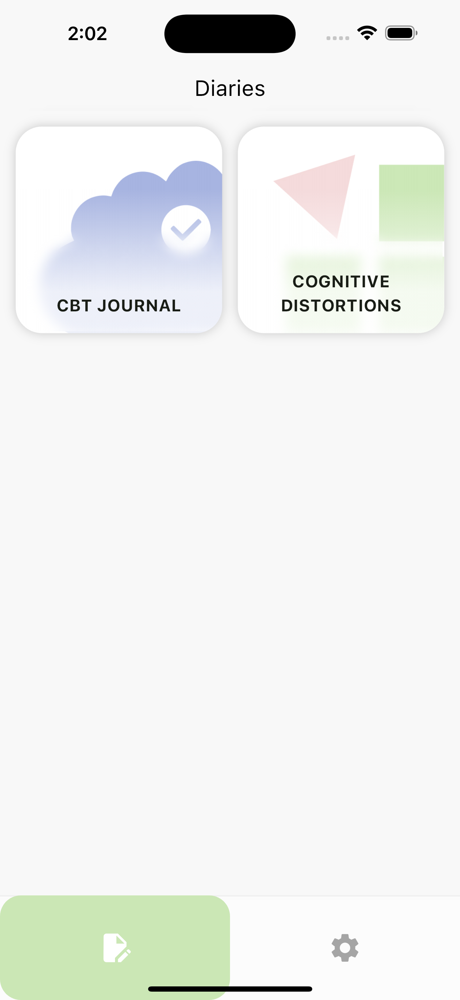
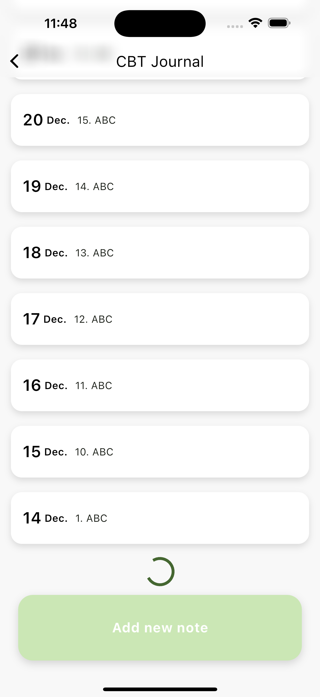
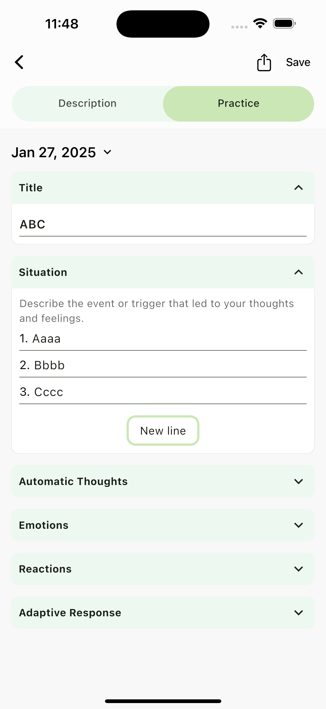
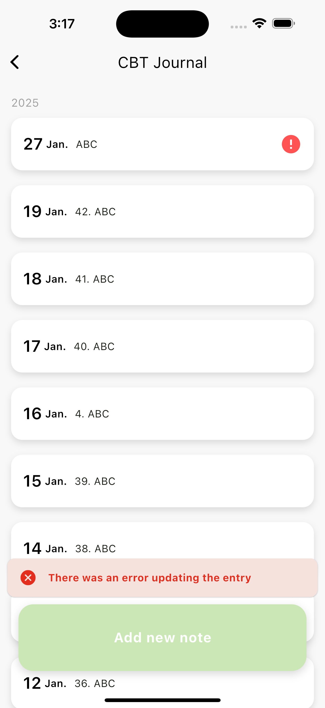

# CBT Diary Demo App

**A Flutter Demo App for Portfolio**

## 🚀 Description

This project demonstrates my skills in Flutter development. The application is a demo version of the
original CBT Diary, allowing users to make journal entries and track their psycho-emotional state.

#### Included Features:

* Entries List Page: Displays a list of journal entries stored in the cloud.
* Upsert Entry Page: Allows creating, saving and updating entries.
* Optimistic UI: Provides instant visual feedback for added/removed entries before the server
  confirms changes.
* Anonymous Authentication: Utilizes Firebase Auth to securely store user data without requiring
  full registration.

## 🖼️ Screenshots

| Diaries Screen                                       | Entries Screen (Lazy loading)                                    |
|------------------------------------------------------|------------------------------------------------------------------|
|     |        |

| Update Note Screen                                   | Entries Screen (Error occurred)                                  |
|------------------------------------------------------|------------------------------------------------------------------|
|  |  |

## 🔑 Key Features

1. BLoC Architecture & DDD-inspired Structure

* Clear separation of business logic (domain layer) and external integrations (infrastructure
  layer).
* Highly testable and maintainable codebase following domain and infrastructure folders.

2. Firestore Integration

* Firebase Firestore is used for persistent storage.
* Data is fetched on-demand and updated when a user adds or modifies an entry.

3. Concurrency Handling

* Supports multiple parallel updates to ensure that concurrent actions (e.g., adding or updating
  several entries simultaneously) work seamlessly.
* Tracks the state of individual entries during updates to provide accurate feedback in the UI.

4. Optimistic UI & Error Handling

* Optimistic Updates for a smoother user experience by showing immediate feedback before server
  confirmation.
* Snackbars notify users of success or error states.
* Robust error management for handling network or server-related issues.

5. Lazy Loading for Entries

* Efficiently loads journal entries as users scroll down, reducing initial load time and memory
  usage.
* Optimized for handling large datasets.

6. Anonymous Firebase Auth

* Quick and secure data access without forcing users to create accounts.
* Ensures each user’s entries remain private and isolated.

7. Scalable & Modular Code

* Layered architecture supports easy feature expansion.
* Reusable components and widgets for consistent UI.

## 🛠️ Technologies Used

* Flutter (3.x)
    * Modern UI toolkit for crafting cross-plarform apps.
    * Material and Cupertino design principles where needed.
* Dart
    * Main programming language for Flutter.
* BLoC (Business Logic Component)
    * Manages state changes and business logic.
    * Facilitates modular, reactive programming.
* Firebase Services
    * Firestore for real-time, cloud-based data storage.
    * Firebase Auth (Anonymous) for secure, simplified user management.
    * Configured with FlutterFire CLI for seamless integration.
* Domain-Driven Design (DDD) Approach
    * Domain layer: Entities, value objects, use cases.
    * Infrastructure layer: Repositories, Firebase data sources, Auth logic.

## 📦 Installation

1. **Clone the Repository**

   `git clone https://github.com/frendy0/cbtdiaries_demo.git`

2. **Navigate to the Project Directory**

   `cd cbtdiaries_demo`

3. **Install Dependencies**

   `flutter pub get`

4. **Configure Firebase using FlutterFire**

* Install FlutterFire CLI:

  `dart pub global activate flutterfire_cli`
* Run the configuration command in the project directory

  `flutterfire configure`

* Follow the prompts to select the Firebase project.

5. **Run the App**

## 📄 License

This project is licensed under the All Rights Reserved License.

For further details, please refer to the [LICENSE](./LICENSE) file in this repository.

## 🤝 Acknowledgments

Special thanks to the CBT Diary team for the opportunity to build and enhance this project. 